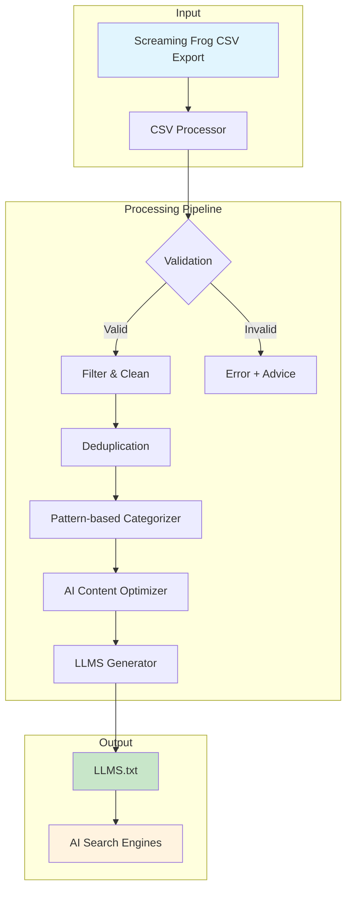

# LLMS File Builder 🧠📄

> Transform your Screaming Frog SEO crawls into AI-optimized LLMS.txt files for enhanced discoverability on ChatGPT, Claude, Perplexity, and other AI search engines.

[](https://www.python.org/downloads/)
[](LICENSE)
[](https://openai.com/)

## 🎯 Why LLMS.txt?

AI search engines are increasingly used for finding businesses and services. An LLMS.txt file helps these AI systems understand your website's structure and content, similar to how robots.txt helps traditional search engines. This tool automates the creation of these files from your existing SEO crawl data, with built-in AI optimization for maximum discoverability.

## 🏗️ Architecture



### Component Overview

| Component | Purpose | Key Features |
|-----------|---------|--------------|
| **CSV Processor** | Validates and cleans Screaming Frog exports | • Filters non-content pages<br>• Quality scoring<br>• Duplicate removal |
| **Categorizer** | Groups pages into logical sections | • Pattern-based matching<br>• Medical/healthcare focus<br>• Built-in AI enhancement |
| **LLMS Generator** | Creates final output file | • Markdown formatting<br>• AI-optimized content<br>• Validation |
| **Streamlit App** | User-friendly interface | • Drag-and-drop upload<br>• Real-time preview<br>• Quality analysis |

## 🚀 Quick Start

### Prerequisites

- Python 3.8+
- Screaming Frog SEO Spider (for crawling websites)
- OpenAI API key (optional, for enhanced descriptions)

### Installation

```bash
# Clone the repository
git clone https://github.com/yourusername/llms-file-builder.git
cd llms-file-builder

# Create virtual environment
python -m venv .venv

# Activate virtual environment
# On Windows:
.venv\Scripts\activate
# On macOS/Linux:
source .venv/bin/activate

# Install dependencies
pip install -r requirements.txt

# Set up environment variables
cp .env.example .env
# Edit .env and add your OpenAI API key (optional)
```

## 📖 Usage Guide

### Step 1: Export from Screaming Frog

**Important**: Export only HTML pages for best results!

1. Open Screaming Frog SEO Spider
2. Crawl your website
3. Click the **"Internal"** tab
4. Use the **Filter dropdown → Select "HTML"**
5. Go to **File → Export** → Save as CSV

### Step 2: Generate LLMS.txt

#### Option A: Command Line Interface

```bash
# Basic usage (includes AI optimization)
python run.py data/your-crawl.csv

# Preview without saving
python run.py data/your-crawl.csv --preview

# Custom output filename
python run.py data/your-crawl.csv --output mysite_llms
```

#### Option B: Web Interface

```bash
# Launch the Streamlit app
streamlit run app.py

# Then open http://localhost:8501 in your browser
```

### Step 3: Deploy LLMS.txt

Place the generated `LLMS.txt` file in your website's root directory (e.g., `https://yoursite.com/llms.txt`)

## ⚙️ Configuration

### Default Category Patterns

The tool uses intelligent pattern matching to categorize pages:

```python
CATEGORY_PATTERNS = {
    "Services": ["services", "therapy", "treatment", "procedure"],
    "Areas Treated": ["conditions", "pain", "symptoms"],
    "Blog": ["blog", "article", "news", "insights"],
    "Providers": ["doctor", "physician", "team", "staff"],
    "Locations": ["location", "office", "clinic", "directions"],
    "Patient Resources": ["forms", "insurance", "faq", "appointment"],
    "About": ["about", "mission", "values", "history"]
}
```

### Customizing Categories

Edit `backend/categorizer.py` to add your own patterns:

```python
# Add industry-specific patterns
CUSTOM_PATTERNS = {
    "Products": ["product", "shop", "store", "catalog"],
    "Case Studies": ["case-study", "success-story", "client"],
    "Support": ["help", "support", "documentation", "guide"]
}

categorizer.update_patterns(CUSTOM_PATTERNS)
```

## 🎨 Output Format

### LLMS.txt Structure

```markdown
# Your Site Name

> Brief description of your website and its purpose

## Services
- [Service Name](https://site.com/service): AI-optimized description of the service
- [Another Service](https://site.com/service-2): What this service offers

## Locations
- [City Location](https://site.com/locations/city): Address and specialties offered

## Blog
- [Article Title](https://site.com/blog/article): Key insights and topics covered
```


## 🤖 Built-in AI Enhancement

The tool automatically:

1. **Preserves** accurate pattern-based categorization
2. **Enhances** titles and descriptions for AI search visibility
3. **Optimizes** content specifically for LLMS.txt format
4. **Maximizes** discoverability in ChatGPT, Claude, Perplexity, and other AI search engines

### GPT Optimization Focus

- **Services**: Emphasizes solutions and outcomes
- **Providers**: Highlights expertise and specializations  
- **Locations**: Includes accessibility and service availability
- **Blog**: Focuses on educational value and key takeaways

## 📊 Quality Assurance

The tool includes comprehensive quality checks:

### CSV Quality Analysis

- **Detects** improperly filtered exports (images, CSS, JS files)
- **Scores** export quality (0-100)
- **Provides** specific export instructions
- **Suggests** improvements for better results

### Content Validation

- **Removes** duplicate URLs and titles
- **Filters** non-indexable pages
- **Improves** empty descriptions
- **Validates** output structure

## 🛠️ API Reference

### LLMSProcessor

```python
from backend import LLMSProcessor

# Initialize processor with built-in AI optimization
processor = LLMSProcessor(
    output_dir="exports",
    api_key="your-api-key"  # Optional, uses env var by default
)

# Process file
result = processor.process_file(
    csv_path="data/crawl.csv",
    preview_only=False,
    custom_filename="mysite"
)

# Result structure
{
    "success": True,
    "files": {
        "txt_path": "exports/mysite.txt"
    },
    "stats": {
        "total_rows": 500,
        "indexable_pages": 300,
        "unique_pages": 250
    },
    "categories": {
        "Services": 45,
        "Blog": 120,
        "Locations": 10
    }
}
```

### Categorizer

```python
from backend import Categorizer

# Categorization with built-in AI optimization
categorizer = Categorizer()  # AI enhancement is always enabled
categorizer.update_patterns({
    "Custom Category": ["pattern1", "pattern2"]
})

# Categorize pages
categorized = categorizer.categorize_pages(
    pages=[...],
    site_metadata={...}
)
```

## 🧪 Testing

Run the test suite to verify your setup:

```bash
# Basic setup test
python test_setup.py

# Run all tests (coming soon)
pytest tests/

# Test with sample data
python run.py data/test/test_crawl.csv --preview
```

## 🚧 Troubleshooting

### Common Issues

| Issue | Solution |
|-------|----------|
| **Too many non-content files** | Re-export with HTML filter in Screaming Frog |
| **Missing columns error** | Ensure you're exporting from the "Internal" tab |
| **GPT timeout** | Process in smaller batches or disable GPT enhancement |
| **Empty descriptions** | Check if meta descriptions exist in your crawl |

### Debug Mode

```bash
# Enable verbose logging
export LOG_LEVEL=DEBUG
python run.py data/crawl.csv
```

## 🤝 Contributing

We welcome contributions! Please see our [Contributing Guide](CONTRIBUTING.md) for details.

### Development Setup

```bash
# Install dev dependencies
pip install -r requirements-dev.txt

# Run linters
black backend/
pylint backend/

# Run type checking
mypy backend/
```

## 📈 Roadmap

- [ ] Multi-language support
- [ ] Custom industry templates
- [ ] Bulk processing mode
- [ ] API endpoint
- [ ] WordPress plugin
- [ ] Chrome extension
- [ ] Advanced analytics dashboard

## 📄 License

This project is licensed under the MIT License - see the [LICENSE](LICENSE) file for details.

## 🙏 Acknowledgments

- OpenAI for GPT-3.5 API
- Screaming Frog for the excellent SEO Spider tool
- The LLMS.txt specification creators

## 💬 Support

- **Documentation**: [Full docs](https://docs.llmsfilebuilder.com)
- **Issues**: [GitHub Issues](https://github.com/reallyreallyryan/llms-file-builder/issues)
- **Discussions**: [GitHub Discussions](https://github.com/reallyreallyryan/llms-file-builder/discussions)

---

Made with ❤️ for the AI-first web by Ryan K